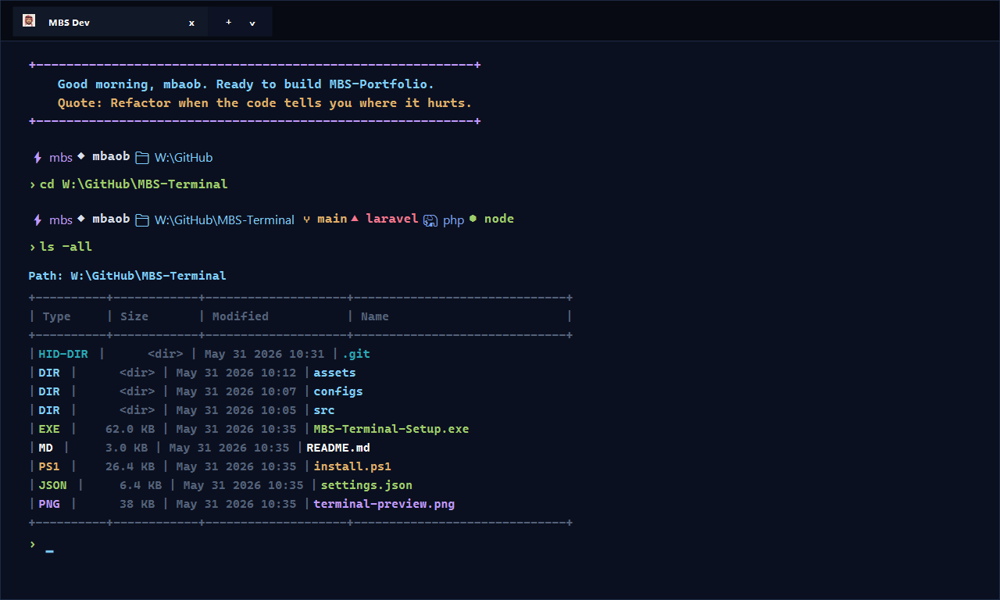

# MBS Terminal

[](LICENSE)
[](#requirements)
[](#what-the-installer-changes)
[](#laravel-workflow)
[](https://github.com/sponsors/mbs047)

MBS Terminal is a polished Windows Terminal setup for Laravel and PHP development. It installs the MBS Midnight theme, pixel avatar profile icons, a colorful Starship prompt, a friendly PowerShell welcome banner, Laravel shortcuts, smarter autocomplete, and custom directory tools.



## Highlights

- Premium dark Windows Terminal profile with acrylic, Mica-friendly tab styling, and the **MBS Midnight** palette.
- Pixel avatar tab icon plus dedicated profile icons for PowerShell, Command Prompt, and Azure Cloud Shell.
- Starship prompt with Laravel, Git, PHP, Node, Python, package, command duration, and clock segments.
- Installer wizard for PHP `8.2`, `8.3`, `8.4`, `8.5`, Composer, Laravel Installer, Valet for Windows, Pint, Envoy, Vapor CLI, Starship, and updates.
- Empty `cd` opens the interactive folder navigator. `cd path\to\folder` stays normal.
- Custom `ls` table view with hidden-file, file-only, directory-only, recursive, and navigator modes.
- PowerShell welcome banner that uses your chosen setup name or your Windows username.
- Restore utility that backs up and removes the MBS configuration safely.

## Prompt Icons

| Icon | Segment | Color | Meaning |
| --- | --- | --- | --- |
| `⚡` | `mbs` | `#C099FF` | MBS prompt brand mark |
| `◆` | username | `#D6DEEB` | Display name from the installer or Windows user |
| `📁` | directory | `#7DCFFF` | Current working directory |
| `⑂` | Git branch | `#E0AF68` | Current branch name |
| `▲` | Laravel | `#F7768E` | Appears when an `artisan` file is detected |
| `🐘` | PHP | `#7AA2F7` | PHP context |
| `⬢` | Node | `#9ECE6A` | Node.js context |
| `◇` | package | `#C099FF` | Package version context |
| `🐍` | Python | `#9ECE6A` | Python context |
| `⏱` | duration | `#53627A` | Long-running command duration |
| `🕒` | time | `#53627A` | Right-aligned clock |
| `›` / `×` | prompt | green / red | Success or error prompt marker |

## Git Status Marks

| Mark | Meaning |
| --- | --- |
| `⇡` | Ahead of remote |
| `⇣` | Behind remote |
| `⇕` | Diverged from remote |
| `×` | Conflict |
| `−` | Deleted file |
| `●` | Modified file |
| `»` | Renamed file |
| `✓` | Staged file |
| `≡` | Stashed changes |
| `?` | Untracked file |

## MBS Midnight Palette

| Role | Hex |
| --- | --- |
| Background | `#0B1020` |
| Foreground | `#D6DEEB` |
| Cyan | `#7DCFFF` |
| Purple | `#C099FF` |
| Red | `#F7768E` |
| Yellow | `#E0AF68` |
| Green | `#9ECE6A` |
| Blue | `#7AA2F7` |
| Muted | `#53627A` |

## Included Profile Icons

| Asset | Used For |
| --- | --- |
| `assets/terminal-icons/mbs-pixel-avatar.png` | Main **MBS Dev Shell** tab icon |
| `assets/terminal-icons/mbs-dev-shell.png` | PowerShell developer shell profile |
| `assets/terminal-icons/mbs-cmd.png` | Command Prompt profile |
| `assets/terminal-icons/mbs-cloud.png` | Azure Cloud Shell profile |
| `assets/terminal-icons/mbs-terminal.ico` | Setup and restore executable icon |

## Laravel Workflow

| Command | What It Does |
| --- | --- |
| `pa migrate` | Runs `php artisan migrate` |
| `pat` | Runs `php artisan test --compact` |
| `pclear` | Runs `php artisan optimize:clear` |
| `proutes` | Runs `php artisan route:list --except-vendor` |
| `ptinker` | Runs `php artisan tinker` |
| `ldev` | Starts the best available local dev command |
| `nr dev` | Runs `npm run dev` |

## Directory Tools

| Command | Behavior |
| --- | --- |
| `cd` | Opens the interactive folder navigator |
| `cd W:\GitHub\MBS-Terminal` | Normal PowerShell directory change |
| `ls` | Shows a clean table and hides dot-prefixed entries |
| `ls -la` or `ls -all` | Shows hidden files |
| `ls -nav` | Opens the arrow-key folder navigator |
| `ls -file` | Shows files only |
| `ls -dir` | Shows directories only |
| `ls -recursive` | Shows recursive results |

Navigator keys: `Up` / `Down` select, `Enter` opens, `Backspace` goes up, `Esc` or `Q` exits.

## `ls` Color Guide

| Type | Color | Examples |
| --- | --- | --- |
| Directories | Cyan | `assets`, `configs`, `src` |
| Hidden directories | Dark cyan | `.git` |
| Executables | Green | `.exe`, `.cmd`, `.bat`, `.msi` |
| PowerShell scripts | Yellow | `.ps1`, `.psm1`, `.psd1` |
| JavaScript / TypeScript | Yellow | `.js`, `.jsx`, `.ts`, `.tsx`, `.mjs`, `.cjs` |
| PHP / Blade | Magenta | `.php`, `.phtml`, `.blade.php` |
| Config files | Green | `.json`, `.jsonc`, `.toml`, `.yml`, `.yaml`, `.xml`, `.config` |
| Stylesheets | Blue | `.css`, `.scss`, `.sass`, `.less` |
| Documents | White | `.md`, `.markdown`, `.txt`, `.rst` |
| Images and icons | Purple | `.png`, `.jpg`, `.jpeg`, `.gif`, `.svg`, `.ico`, `.webp` |
| Archives and env files | Dark yellow | `.zip`, `.7z`, `.rar`, `.tar`, `.gz`, `.env` |
| Lock and log files | Dark gray | `.lock`, `.log` |

## Autocomplete

| Key | Behavior |
| --- | --- |
| `Tab` | Accepts the gray suggestion |
| `RightArrow` | Accepts the full suggestion |
| `Alt+RightArrow` | Accepts the next suggestion word |
| `Ctrl+Space` | Opens the completion menu |

## Requirements

- Windows 10 or Windows 11.
- Windows Terminal.
- Windows PowerShell 5.1 or later.
- Starship for the prompt. The setup wizard can install it through `winget`.
- Optional: Git, PHP, Node.js, Python, Composer, and Laravel tooling.

## Install

Run the visual installer:

```powershell
.\MBS-Terminal-Setup.exe
```

The wizard can install or configure:

- Terminal profile and icons.
- PHP `8.2`, `8.3`, `8.4`, or `8.5`.
- Existing PHP directory from Laragon, XAMPP, Herd, or a custom build.
- Composer.
- Laravel Installer.
- Valet for Windows.
- Laravel Pint, Envoy, and Vapor CLI.
- Starship.
- Current-user or all-users install scope.

After installation, open a new Windows Terminal tab.

## Script Install

The GUI wraps `install.ps1`. You can also run the script directly:

```powershell
.\install.ps1 -InstallDependencies -InstallPhp -PhpVersion 8.4 -InstallComposer -InstallLaravel
```

Useful options:

```powershell
.\install.ps1 -StartingDirectory "W:\GitHub\MBS-Portfolio"
.\install.ps1 -DisplayName "mbaob"
.\install.ps1 -InstallScope CurrentUser
.\install.ps1 -InstallValet -InstallPint -InstallEnvoy -InstallVapor
.\install.ps1 -PhpDirectory "C:\laragon\bin\php\php-8.4"
```

## Restore Defaults

Run the restore utility:

```powershell
.\MBS-Terminal-Restore.exe
```

Or run the script directly:

```powershell
.\restore-default.ps1
```

The restore script creates timestamped backups before changing anything. It resets Windows Terminal settings, removes MBS PowerShell startup hooks, and moves the MBS Starship, helper, and icon files aside.

## What The Installer Changes

- Copies terminal icons to `%USERPROFILE%\.config\terminal-icons`.
- Copies Starship config to `%USERPROFILE%\.config\starship.toml`.
- Copies PowerShell helpers to `%USERPROFILE%\.config\powershell\laravel-dev.ps1`.
- Updates the current Windows PowerShell profile to load helpers and Starship.
- Updates Windows Terminal `settings.json` and creates a timestamped backup first.
- Optionally installs supported development tools through `winget` and Composer.

## Safety Notes

The installer changes local terminal configuration and creates backups before writing Windows Terminal settings. Review `install.ps1` before running it if you are installing from a fork or untrusted download.

## Build The EXEs

```powershell
.\build-installer.ps1
```

The build uses the built-in .NET Framework C# compiler on Windows.

## Support

For setup help, see [SUPPORT.md](SUPPORT.md). For responsible disclosure, see [SECURITY.md](SECURITY.md). For contributing, see [CONTRIBUTING.md](CONTRIBUTING.md).

If MBS Terminal saves you setup time, you can support it through [GitHub Sponsors](https://github.com/sponsors/mbs047). Donations are optional and never required to use or contribute to the project.

## License

MIT License. See [LICENSE](LICENSE).
